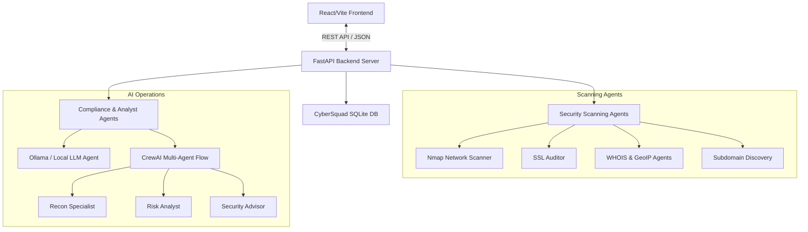

# 🛡️ CyberSquad X

### *AI-Powered Cybersecurity Operations & Assessment Platform*


CyberSquad X is a modern, state-of-the-art cybersecurity analysis platform that automates attack surface discovery, scans target networks, checks SSL/WHOIS info, maps vulnerabilities to **OWASP Top 10** and **MITRE ATT&CK** frameworks, and generates detailed security compliance audits using **local AI Agents** (Ollama/CrewAI).

---

## 🚀 Key Features

- **🌐 Comprehensive Target Scanning**: Performs quick directory audits, port mapping (via Nmap), subdomain discovery, SSL certificate audits, and WHOIS lookups.
- **🚨 Advanced Threat Intelligence**: Detects common CVEs, maps findings to **OWASP Top 10** vulnerabilities, and performs **MITRE ATT&CK** technique mapping.
- **👥 Multi-Agent Security Analysis**: Integrates **CrewAI** and **Ollama** agents (using local models like `mistral`) to analyze risks, calculate scores, and write executive security reports.
- **📄 Executive PDF Reporting**: Instantly compiles and downloads security assessment results into high-quality PDF reports.
- **🛡️ Modern Security Console**: Designed with a high-end glassmorphism dark theme, featuring interactive stats cards, live threat level indicators, risk gauges, and history trends.

---

## 📐 Platform Architecture



---

## 🛠️ Project Structure

```
├── agents/                  # Local scanners and crewAI flows
│   ├── crew/
│   │   └── cybersquad_crew.py # CrewAI multi-agent definition
│   ├── nmap_agent.py        # Wrapper for Nmap network commands
│   └── ollama_agent.py      # Local Ollama AI client wrapper
├── api/                     # Backend FastAPI application
│   ├── agents/              # Modular security analytical agents
│   │   ├── compliance_agent.py   # Audits NIST/ISO/OWASP controls
│   │   ├── mitre_agent.py        # Maps issues to MITRE ATT&CK
│   │   └── ssl_agent.py          # Performs certificate verification
│   ├── auth/                # JWT and authentication helpers
│   ├── models/              # Pydantic request & response models
│   └── app.py               # Main API application entrypoint
├── cybersquad-frontend/     # Modern React + Vite frontend console
│   ├── src/
│   │   ├── components/      # Sidebar, Navbar, Charts, and gauges
│   │   └── pages/           # Dashboard, Login, and Admin screens
└── database/                # SQLite local storage driver
```

---

## 📦 Local Installation & Setup

### Prerequisites
- **Python 3.10+**
- **Node.js 18+**
- **Nmap** (must be added to your system's PATH)
- **Ollama** (running locally with `mistral` pulled: `ollama pull mistral`)

### 1. Backend Setup
1. Navigate to the root directory:
   ```bash
   cd cybersquad
   ```
2. Install python dependencies:
   ```bash
   pip install -r requirements.txt
   ```
   *(Note: Ensure crewai, fastapi, uvicorn, pyjwt, bcrypt, and fpdf are installed.)*
3. Launch the API server:
   ```bash
   python -m uvicorn api.app:app --host 127.0.0.1 --port 8000
   ```

### 2. Frontend Setup
1. Navigate to the frontend directory:
   ```bash
   cd cybersquad-frontend
   ```
2. Install npm dependencies:
   ```bash
   npm install
   ```
3. Start the local Vite development server:
   ```bash
   npm run dev
   ```
4. Access the web dashboard at **`http://localhost:5173`**.

---

## 🔑 Access Credentials

To log in to the Security Console, use the following default credentials:

| Identity | Cryptokey (Password) | Role |
| :--- | :--- | :--- |
| `admin` | `admin123` | **Administrator** |
| `analyst` | `analyst123` | **Security Analyst** |
| `viewer` | `viewer123` | **Guest Observer** |

---

## 🛡️ License

This project is licensed under the MIT License.
